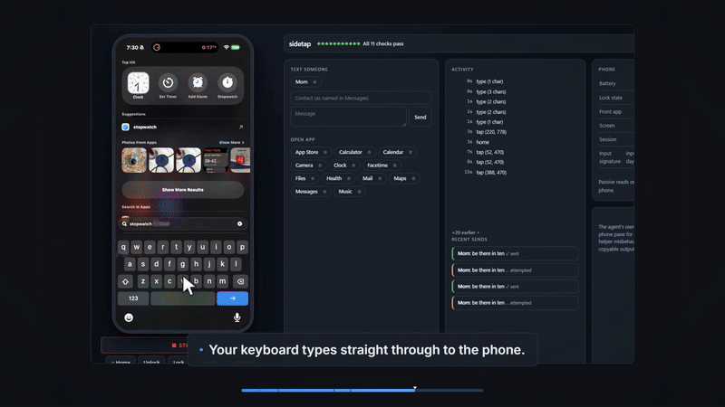

# Marketing Studio

An agent-driven marketing studio for Claude Code. You type `/marketing` in your product's repo; the agent onboards your brand, films your app, renders a full marketing asset suite in this engine, and copies the finished files back to you.



*An animated OG loop the studio rendered for a real product, from brand tokens alone. More in [`examples/`](examples/).*

## The one command

```
/marketing
```

One run produces, in order:

| # | Asset | Skill behind it |
|---|-------|-----------------|
| 1 | Logo reveal (Blender + Remotion) | `/logo-reveal` |
| 2 | Product demo with camera zooms and cursor (Playwright capture) | `/product-demo` |
| 3 | 30 to 90 second launch video composing demo, logo, and copy | `/launch-video` |
| 4 | Voiceover and music scored to the launch video (ElevenLabs) | `/audio-track` |
| 5 | Social clips per platform (X, LinkedIn, TikTok) | `/social-clip` |
| 6 | OG image, animated OG loop, README GIF | `/og-assets` |

The order is deliberate: the cheapest composition renders first so brand-token bugs surface before the expensive assets, the demo is filmed once and its footage feeds everything downstream, and audio is scored only after the launch video is picture-locked. The run keeps a manifest on disk, so a died session resumes where it stopped instead of starting over.

Around those assets, the pipeline adds:

- **A derived content brief.** The agent reads your product repo (README, routes, landing page) and synthesizes the story — hooks, ranked benefit-led features, per-act narration, per-platform copy — into a validated `brief.json` that every builder consumes. You approve the whole story on a storyboard page before anything renders.
- **A copy linter.** Every generated line is gated for em dashes, hype, and AI-slop vocabulary before it can reach a render.
- **A film grade and per-brand motion personality.** Grain, vignette, and bloom tuned per brand, and a `motion` token block so each brand's choreography feels like itself. Grain size is stated at 1080p and scaled by frame height, so an asset carries the same visual grain at 4K. Optional `halation` blooms wherever the frame is *actually* bright rather than glowing a fixed spot, which is the difference between footage that reads photographed and a flat vector comp.
- **An export matrix.** The picture-locked launch video and social clips fan into 16:9, 9:16, 1:1, and 4:5 through responsive layout (not crops), with burned-caption variants for muted autoplay and SRT/VTT sidecars.
- **Mission Control.** A local click-to-approve gallery: watch assets land, review act-boundary contact sheets before the expensive render, approve or request a redo with a note, and the run reacts — no terminal required.
- **Designed sound.** Whooshes on act cuts, ticks on feature reveals, and a riser into the CTA, generated once as a shared SFX library and mixed under the voiceover automatically.
- **Word-locked sync.** Voiceover lines carry word-level timestamps; when they do, act lengths derive from the measured voice and reveals land on the words that name them, with `judge-av-sync` verifying every cue against the timings. Wordless manifests render exactly as before.
- **Staged product scenes.** A feature act can swap its screenshot for rebuilt native UI (a results list that resolves row by row, a composer that types its own query, a status tracker) filmed by a two-node camera rig with a stage-prop cursor that visibly clicks.
- **A mastered mix.** Final renders pass a two-pass loudness master to -14 LUFS with a true-peak ceiling, measured in the delivered file rather than trusted from the filter graph, plus SFX asset leveling and per-cue audibility proof.
- **A direction pass.** Before a launch film is built, three genuinely different visual directions are written and two are killed (`docs/templates/DIRECTION.md`), and iteration renders are versioned v1, v2, ... so a fix can be proven and an earlier cut recovered.
- **A set judge, not just file judges.** Six mechanical gates run before any human looks: motion craft, palette, A/V sync, demo dead air, size budgets, and `judge-drift`, which scores the whole output directory *as a set*. That last one catches the failure no per-file gate can see — assets that are each individually on-brand but collectively fragment into three or four different-looking brands. It emits a worst-first review grid, because attention is reliable over about six tiles, not twenty.
- **Paste-ready post kits and a footage cache.** Every platform gets a folder with the right-aspect video, a lint-gated caption, alt text, and a posting checklist; the kit root also carries `manifest.json`, a machine-readable index that launch-engine reads to auto-attach videos to X and LinkedIn posts, plus `LICENCES.md` and `DISCLOSURE.md` — what is synthetic, which platform toggle to set at upload, and which obligations the kit does *not* yet cover. Unchanged product UIs are never re-filmed thanks to content-hash caching of capture and Blender staging.

Each asset also works standalone: run `/logo-reveal`, `/product-demo`, `/launch-video`, `/audio-track`, `/social-clip`, or `/og-assets` on its own from any repo.

## Example output

Everything below was produced by one `/marketing` run against a real product, unedited. Turn the sound on: the voiceover and music are generated too.

### sidetap.io (drive a real iPhone from Windows)

<!-- For inline playback, drag examples/sidetap/launch.mp4 into a GitHub comment box
     and paste the resulting user-attachments URL on its own line here. -->

| File | Asset |
|------|-------|
| [`launch.mp4`](examples/sidetap/launch.mp4) | 88s launch video with generated voiceover and music |
| [`demo.mp4`](examples/sidetap/demo.mp4) | Product demo filmed against a live iPhone, with measured camera zooms |
| [`logo-reveal.mp4`](examples/sidetap/logo-reveal.mp4) | Blender draw-on logo reveal |
| [`social-x.mp4`](examples/sidetap/social-x.mp4), [`social-linkedin.mp4`](examples/sidetap/social-linkedin.mp4) | Per-platform social clips |
| [`og.png`](examples/sidetap/og.png), [`og.gif`](examples/sidetap/og.gif), [`og.mp4`](examples/sidetap/og.mp4) | OG image, loop, and video |
| [`readme.gif`](examples/sidetap/readme.gif) | README-sized GIF (the one at the top of this page) |

## How it works

- **One engine, many brands.** All rendering happens in this repo, never in your product's repo. Finished assets are copied out at the end.
- **Remotion is the backbone.** Every final video renders through Remotion compositions in `studio/` (SocialClip, ProductDemo, LogoReveal, LaunchVideo, AnimatedOG).
- **Brands are data.** `brands/<id>.json` holds your product's tokens (13 colors, 3 fonts, tagline, voice rules), zod-validated. Templates resolve `getBrand(brandId)` and never hardcode brand values, so a new product is a JSON file and a logo mark component, not a fork.
- **Feeders produce raw material.** Playwright records your running app for demos, headless Blender renders 3D logo reveals, ElevenLabs generates voiceover and music, and ComfyUI can add AI backdrops. Every feeder degrades cleanly when its dependency is missing.
- **The knowledge lives in the skills.** The `skills/` directory ships the Claude Code skills that operate this repo, including the hard-won gotchas in `docs/PLAYBOOK.md` (camera math, seamless-loop rules, Blender API traps) so the agent does not re-derive them.

## Requirements

Required: [Claude Code](https://claude.com/claude-code), Node 20+, Python 3.10+, and **ffmpeg on your PATH** (26 scripts shell out to `ffmpeg`/`ffprobe` directly).

Optional, each degrading cleanly when absent: Blender for 3D logo reveals, an ElevenLabs API key for voiceover and music, ComfyUI for AI backdrops.

**Remotion licence.** Every final video renders through [Remotion](https://www.remotion.dev/), which is free for individuals and for companies of three people or fewer. Larger companies need a Remotion company licence. That is Remotion's term, separate from this repo's MIT licence.

## Install

### As a plugin

```
/plugin marketplace add ucsandman/marketing-studio
/plugin install marketing-studio@ucsandman
```

Plugin skills are namespaced, so the commands are `/marketing-studio:marketing`, `/marketing-studio:logo-reveal`, and so on.

The engine ships with the plugin, but its npm dependencies do not. Bootstrap once by asking Claude to *"bootstrap the marketing studio engine"*, or run it yourself against the installed plugin directory:

```bash
python <plugin-dir>/launch.py --bootstrap
```

That installs the studio and capture-feeder dependencies and then prints a toolchain report. Copy `.env.example` to `.env` in the same directory if you have a Blender path or an ElevenLabs key.

### From source

```bash
git clone git@github.com:ucsandman/marketing-studio.git
cd marketing-studio
python launch.py --bootstrap    # installs npm deps, then verifies the toolchain
cp .env.example .env            # set BLENDER_PATH / ELEVENLABS_API_KEY if you have them
node scripts/install-skills.mjs # installs /marketing and friends into ~/.claude/skills
```

Installing from source gives you unnamespaced commands (`/marketing` rather than `/marketing-studio:marketing`) and keeps renders in the clone instead of the plugin cache. Use this one if you intend to work on the engine itself.

Then, from your product's repo:

```bash
claude
> /marketing
```

The agent asks one batched round of questions (brand, destination, audio, platforms, checkpoint mode) and runs the whole pipeline. If your brand is new, it derives tokens from your repo's design system (DESIGN.md, Tailwind config, CSS variables) and only asks for what it cannot infer.

## The skills

| Skill | What it does |
|-------|--------------|
| `/marketing` | The full pipeline: sequencing, gates, run manifest, resume, final QA and delivery gallery |
| `/logo-reveal` | Animated logo reveal video (Blender draw-on choreography composited in Remotion) |
| `/product-demo` | Screen-Studio style demo: films your running app, adds measured camera zooms and cursor |
| `/launch-video` | Hero announcement video composing demo footage, logo reveal, and copy |
| `/audio-track` | Voiceover and music for any video, or standalone audio |
| `/social-clip` | Short feature clips sized per platform |
| `/og-assets` | OG image, animated OG loop, README GIF, social cards |
| `marketing-studio` | Shared background skill: engine workflow, brand onboarding, non-negotiables |

The pipeline's supporting skills ship too, so nothing in the run dangles:

| Skill | What it does |
|-------|--------------|
| `/polish` | Final UI quality pass (alignment, spacing, states, micro-detail) before the demo is filmed |
| `/frontend-verify` | Headless route verification: console errors, failed requests, text assertions |
| `/de-vibe` | Removes the AI-generated fingerprint (security tells, slop copy, generic defaults) before anything ships |
| `/ship` | Verify, docs, secrets scan, commit, push ritual |
| `/launch` | Announcement drafts per channel (X, LinkedIn, Show HN, email) with approval gates |

Installing the plugin ships all of them, namespaced under `marketing-studio:`. For a source checkout, `scripts/install-skills.mjs` copies them into `~/.claude/skills` unnamespaced and rewrites the engine path to wherever you cloned this repo; it never overwrites a skill you have symlinked. Two optional plugins deepen the UI-polish phase if you have them (`impeccable` and `frontend-design`); without them the pipeline films your app as-is.

## Repo layout

```
.claude-plugin/    plugin + marketplace manifests (this repo installs as a plugin)
brands/            per-product brand tokens (zod-validated JSON)
studio/            Remotion project: all final video compositions
feeders/blender/   headless bpy scenes (3D logo reveals)
feeders/capture/   Playwright recorder (product demos)
feeders/audio/     ElevenLabs client (voiceover + music)
feeders/comfy/     ComfyUI client (optional AI backdrops)
skills/            the Claude Code skills that drive all of this
examples/          real output: the full asset suite for one shipped product
scripts/           props builders, staging, statics, smoke, copy linter, brief
                   gatherer, storyboard board, export matrix, captions, thumbs,
                   post kit, contact sheets, footage cache, SFX library,
                   Mission Control review server
props/             generated render props (edit via their builder scripts only)
docs/PLAYBOOK.md   the operational reference: engine map, onboarding, gotchas
launch.py          single-command health check + Remotion Studio
```

`out/`, `assets/`, and `studio/public/*/` are build products and stay untracked.

## Manual controls

Everything the skills do can be run by hand:

```bash
python launch.py                    # health checks + Remotion Studio
node scripts/smoke.mjs              # frame-0 still of every composition
cd studio && npx remotion render LogoReveal ../out/<brand>/logo.mp4 \
  --props='{"brandId":"<brand>","cta":"..."}'
node scripts/lint-copy.mjs props/<brand>-launch.json   # no-slop copy gate
node scripts/render-matrix.mjs <brand> --stills-only   # 16:9/9:16/1:1/4:5 fan-out
node scripts/build-captions.mjs <brand> --check        # SRT/VTT sidecars
node scripts/mission-control.mjs <brand>               # click-to-approve run console
node scripts/master-audio.mjs out/<brand>/launch.mp4   # -14 LUFS master, verified in the delivered file
node scripts/verify-cue.mjs out/<brand>/launch.mp4 2 1.5  # prove a sound cue is audible in a window
node scripts/judge-motion.mjs <brand>                  # motion-craft + motion/grade token bands
node scripts/judge-drift.mjs <brand>                   # scores out/<brand>/ as a SET; writes a worst-first review grid
node scripts/build-postkit.mjs <brand>                 # per-platform kits + LICENCES.md + DISCLOSURE.md
```

`docs/PLAYBOOK.md` has the full engine map: every feeder, builder script, and render command, plus the verified gotchas.

## Adding a brand

1. `brands/<id>.json` copying the shape of an existing brand (colors, fonts, tagline, voice rules).
2. Register it in `studio/src/lib/brand.ts` and add a mark component in `studio/src/brands/`.
3. `cd studio && npm test` validates the schema.

Only `id`, `name`, `tagline`, `url`, `colors` (13), `fonts` (3) and `voice` are required. Every other block is optional and defaults to the value it was hardcoded to before the token existed, so a brand that omits it renders byte-identically:

| Block | What it tunes |
|-------|---------------|
| `motion` | Choreography personality — `tempo`, `exuberance`, `stagger`, `overshoot`, `parallax`, `settle`, `textReveal`. Retunes every entrance without moving a rest position. |
| `grade` | The film pass — `grain`, `grainSize` (stated at 1080p, scaled by frame height), `halation` (highlight bloom that samples the frame), `vignette`, `bloom`, `aberration`, `letterbox`. |
| `effects` | `wash` and `glow` behind the mark. Brands whose rules forbid a hero wash set `wash: 0`. |
| `textAccent`, `progressFill` | Which color tokens carry small colored text and the progress gradient. |
| `speechHint` | How the brand name is SPOKEN when that differs from how it is written. The transcriber cannot read a coined word it has never seen, so the audio judge primes it with this. |

`voice` is not decoration — it is parsed. `judge-palette` reads "never <color>" rules out of it and fails renders that violate them, so write the real constraints there.

Keep `grade` restrained. `judge-motion` warns above `grain` 0.4 and `halation` 0.35: past those, grain reads as compression noise and halation reads as a CSS glow rather than light scattering off film.

The `/marketing` skill does all of this for you from your product repo's design system; the steps above are the manual path. Details in `docs/PLAYBOOK.md`.

## Verification

```bash
python launch.py --check   # toolchain health
node scripts/smoke.mjs     # renders frame 0 of every composition; must stay green
cd studio && npm test      # brand schema, motion standards, timing libs
cd studio && npm run lint  # eslint + tsc
node --test "scripts/**/*.test.mjs"  # script-side gates (judges, postkit, drift descriptors)
```

Every asset prop is nullable with a placeholder, so the smoke test passes on a clean clone with no captures, no Blender, and no API keys.

## License

MIT

## Support

If my tools save you time, you can support my work here:

[](https://github.com/sponsors/ucsandman)
[](https://buymeacoffee.com/wes_sander)
