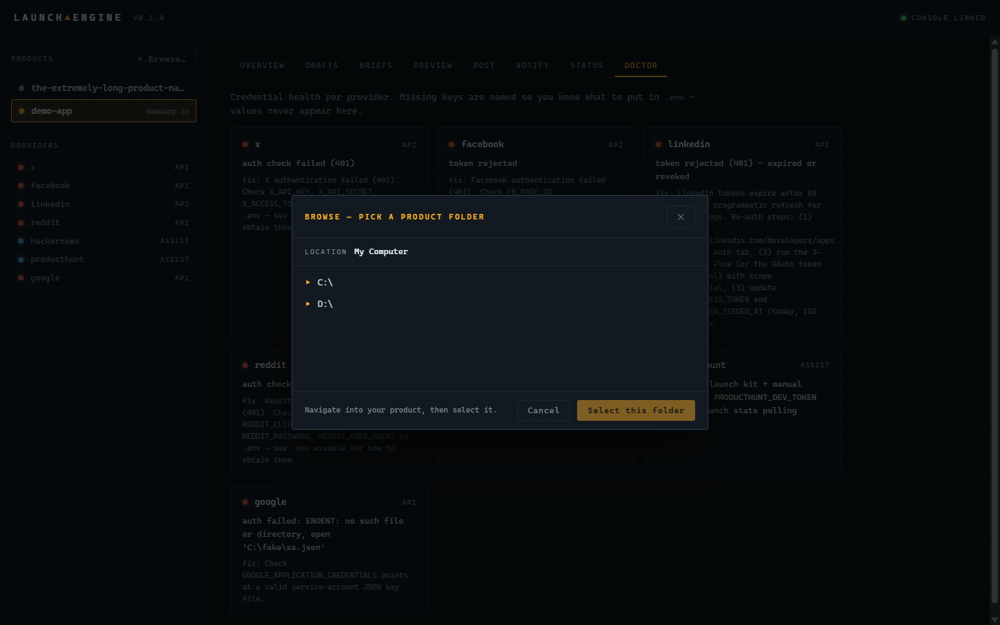
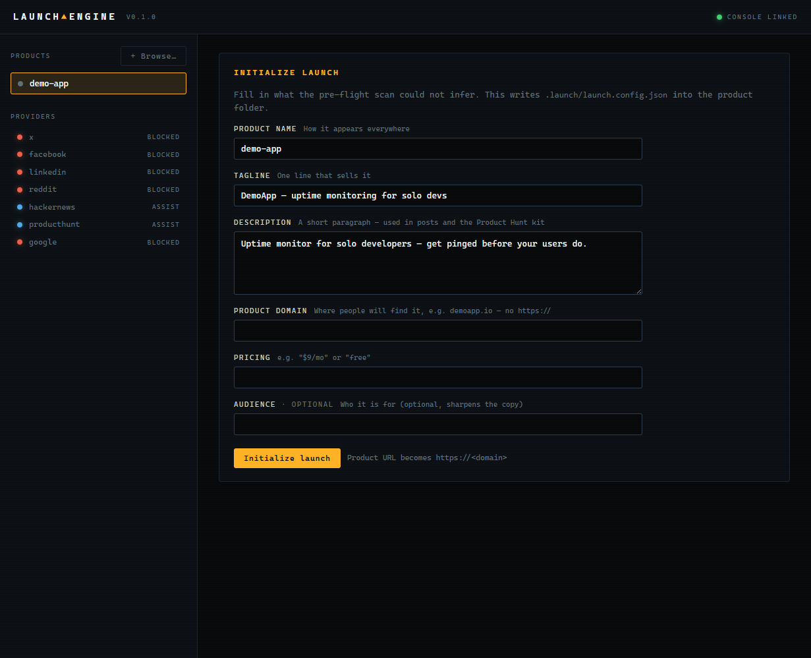
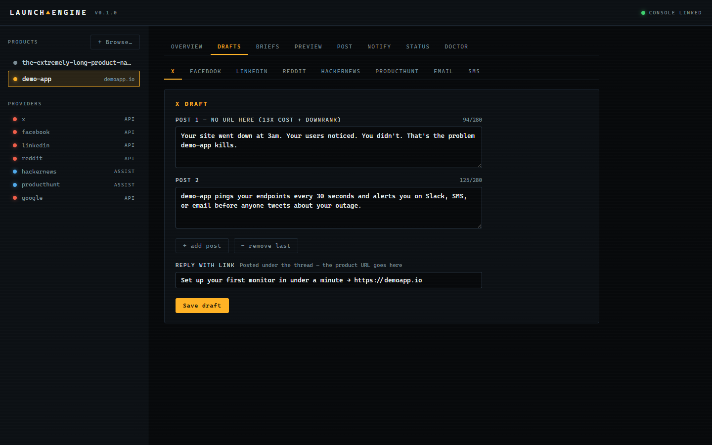
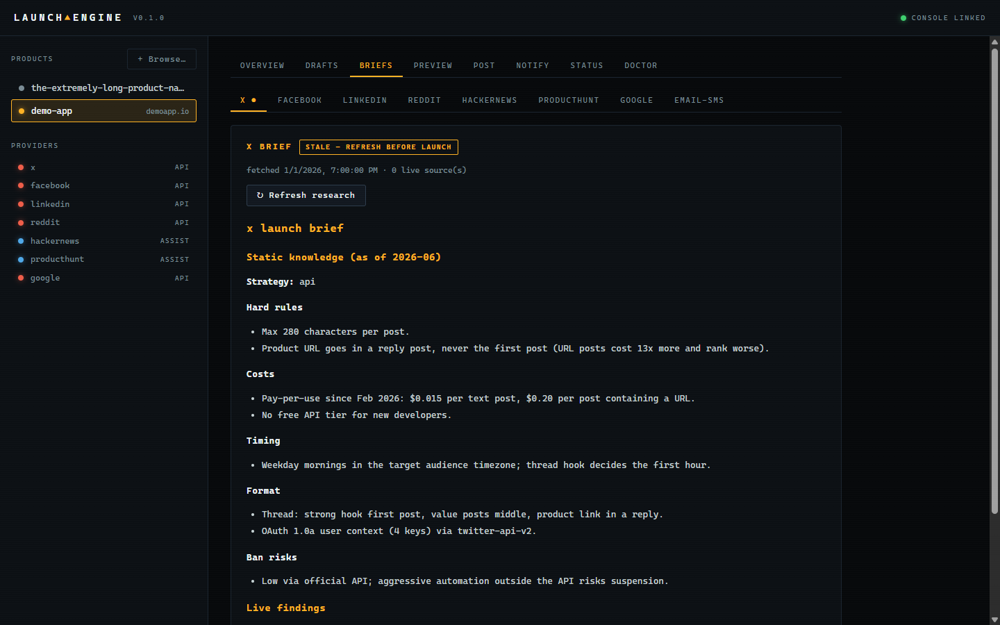
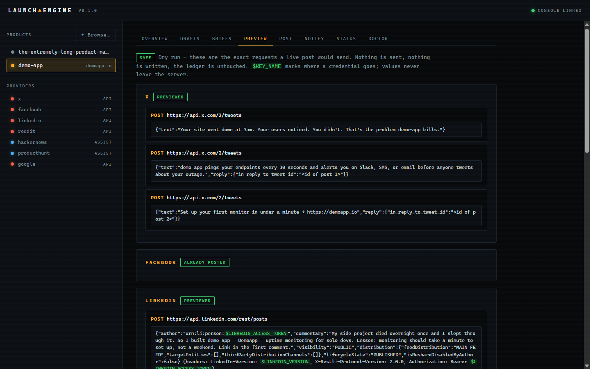
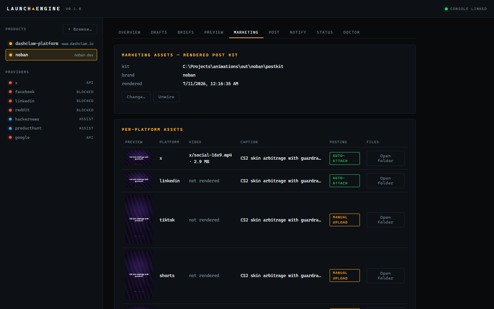
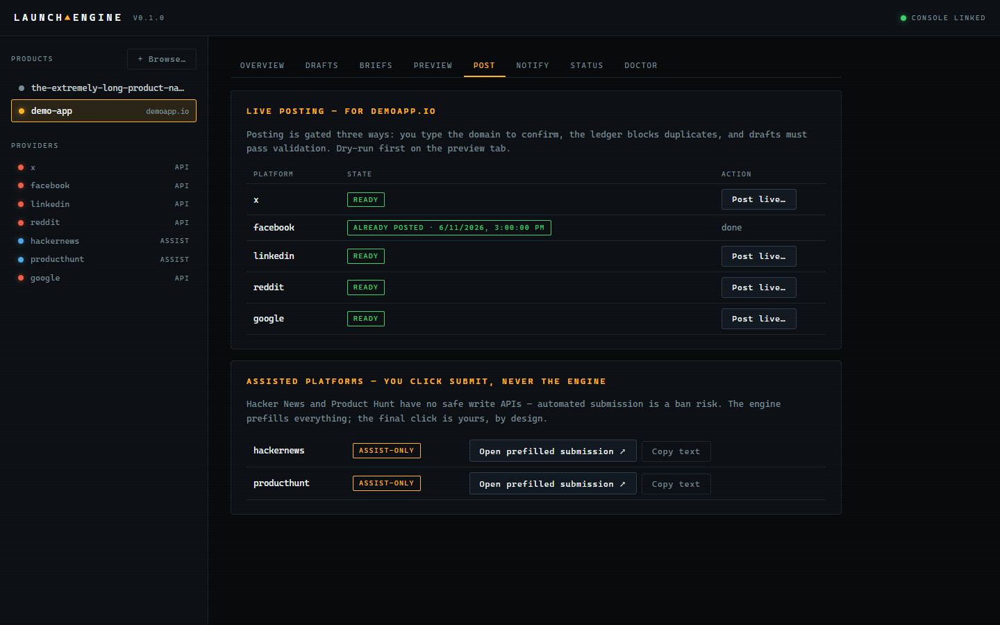
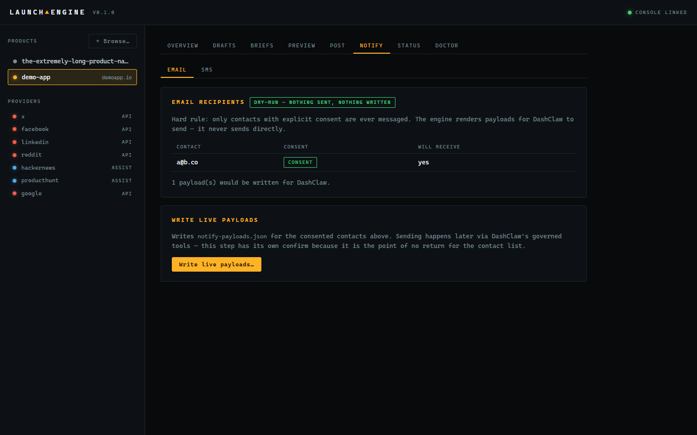
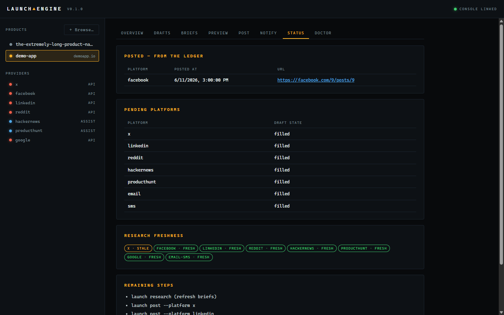
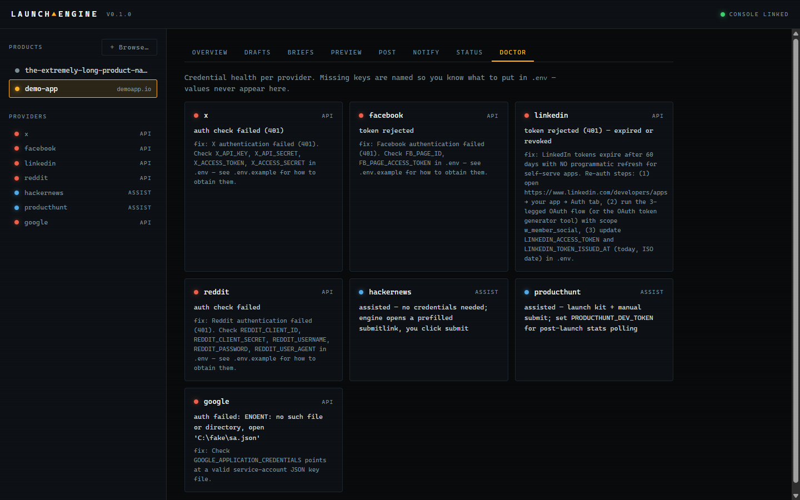

# Launch dashboard (`launch ui`)

A local web GUI over the launch engine: browse to a product on your machine, fill out
launch info in forms, edit drafts with live rule feedback, run doctor/status, preview
exactly what would be posted, and post live behind explicit gates — no CLI flags to
memorize. Every screen wraps the same `run*()` functions the CLI uses, so the GUI and
the CLI can never disagree.

```bash
npm run demo         # fastest path: build + stage a sample product + open the dashboard
```

```bash
npm run build        # builds the CLI and the dashboard bundle (dist/ui)
node dist/index.js ui              # serves on http://127.0.0.1:4400 and opens the browser
node dist/index.js ui --port 5000  # different port
node dist/index.js ui --no-open    # print the URL instead of opening a browser
```

## Security model

The server binds `127.0.0.1` only, rejects any request whose `Host` header is not
localhost (DNS-rebinding guard), and requires a random per-run token on every `/api`
call — the token rides in the launch URL once, moves to sessionStorage, and is scrubbed
from the address bar. If the server restarts, open tabs show a "console link lost"
screen; run `launch ui` again for a fresh session.

## Screens

| Screen | What it does |
|---|---|
| **Picker** | Recent products in the sidebar; "+ Browse…" walks your filesystem (directories only) to add one |
| **Init form** | Replaces `launch init` and its flags; pre-filled from the project scan; inline validation |
| **Drafts** | Per-platform editors with live character counts and server rule violations rendered inline on save |
| **Briefs** | Research briefs as formatted HTML with freshness badges; refresh runs live research |
| **Preview** | Dry-run request previews — `$KEY_NAME` marks where credentials go; values never leave the server |
| **Marketing** | Wire or unwire a post kit (folder picker) from the animations studio; per-platform table of what the kit provides, with auto-attach vs manual-upload badges and an open-folder button per row |
| **Post** | Live posting behind type-the-domain confirmation; ledger blocks duplicates; HN/PH are assist-only; X/LinkedIn rows show an attach chip when a wired kit has video for that platform |
| **Notify** | Contacts with consent badges (non-consented are excluded, visibly); payload writing has its own confirm |
| **Status / Doctor** | Posted vs pending platforms, brief freshness, remaining steps; provider credential health (key names only) |





















## Development loop

```bash
node dist/index.js ui --no-open --port 4400   # backend on 4400
npm run dev:ui                                # vite dev server proxying /api → 4400
```

The vite dev page has no token in its URL — copy the `?token=` from the `launch ui`
output onto the dev URL once per backend run.

## Rehearsal

`node scripts/rehearsal-ui.mjs` boots the dashboard against a temp fixture copy with
fake credentials, exercises every read endpoint plus a dry-run preview, and exits
non-zero on any failure. The Playwright smoke suite (`npx playwright test`) walks the
full flow in a real browser: boot → pick → init → drafts → preview → confirm gate.
